<!-- Generated from README.md by scripts/build-light-readme.mjs. Do not edit by hand. -->

<div align="center">

<picture>
  <source media="(prefers-color-scheme: dark)" srcset="./docs/assets/adk_dev_logo_light.png">
  
</picture>

# WorkOS

**A team work manager - projects, tasks, notes, resources, secrets, calendar and async collaboration in one place, with a Notion-style block editor for everything you write.**


<br>


<br><br>

[](https://github.com/Dileepadari/CompleteOS/actions/workflows/ci.yml)

**Live:** [workos.dileepadari.dev](https://workos.dileepadari.dev) &middot; **[Developer documentation](./DEVDOC.md)** &middot; [Screenshots](#screens)

<p><b>Light mode</b> &middot; <a href="./README.md">View this page in dark mode</a></p>

</div>

---

> **Where this builds.** This repository is a read-only mirror of `apps/workos` in the
> [CompleteOS](https://github.com/Dileepadari/CompleteOS) monorepo, kept in sync as a git subtree.
>
> **It does not build on its own.** The app imports `@completeos/auth-client` and
> `@completeos/ui`, which are workspace packages: not published to npm, not vendored here.
> Clone the monorepo and run `npm ci` from its root, then work in `apps/workos`;
> CI for this app runs there, not here.


## Screens

<table>
<tr>
<td width="33%" valign="top">
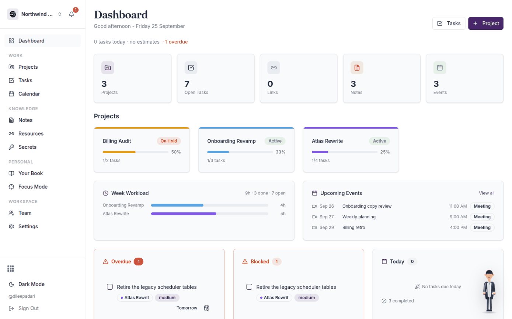
<p align="center"><b>Dashboard</b><br><sub>The day at a glance, with what is overdue and what is blocked</sub></p>
</td>
<td width="33%" valign="top">
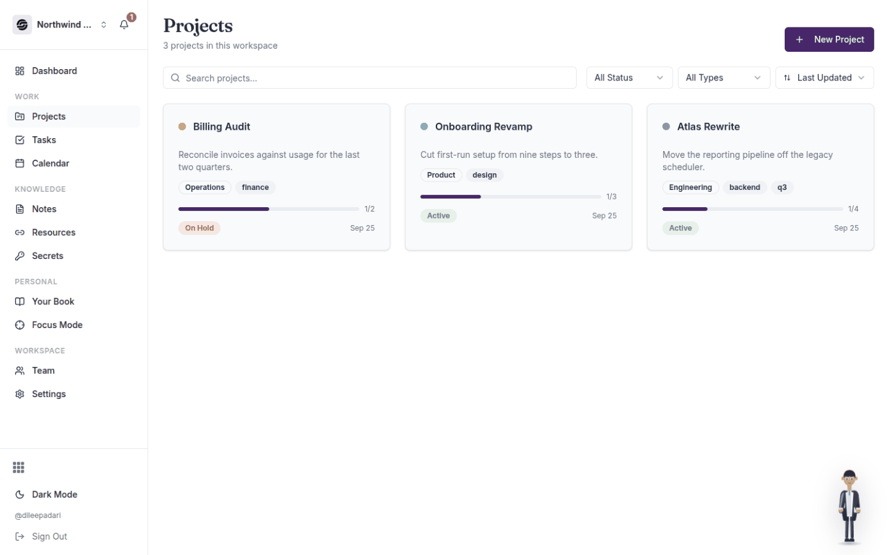
<p align="center"><b>Projects</b><br><sub>Status, type, tags and progress, searchable and sortable</sub></p>
</td>
<td width="33%" valign="top">
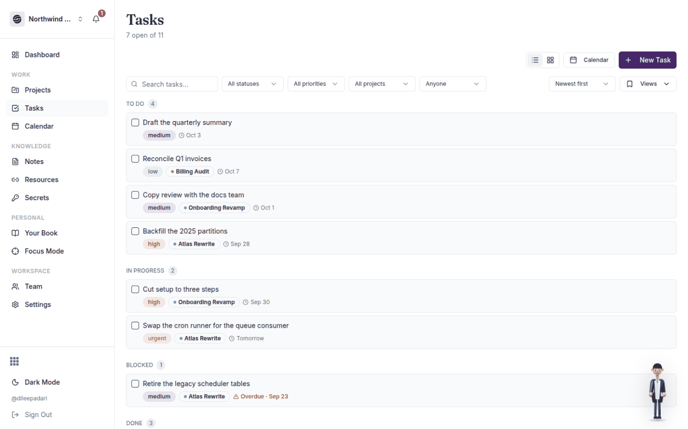
<p align="center"><b>Tasks</b><br><sub>List, board and calendar over one filtered set</sub></p>
</td>
</tr>
<tr>
<td width="33%" valign="top">
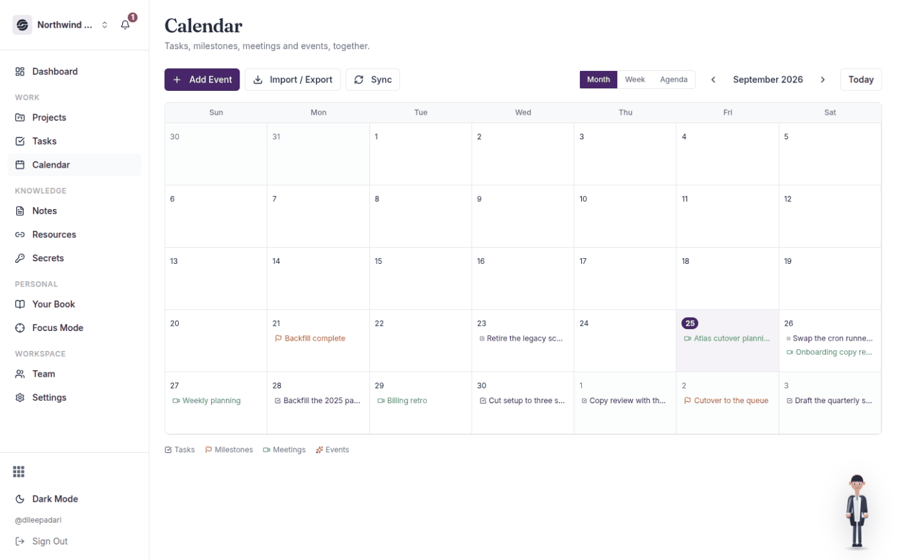
<p align="center"><b>Calendar</b><br><sub>Tasks, milestones, meetings and events together</sub></p>
</td>
<td width="33%" valign="top">
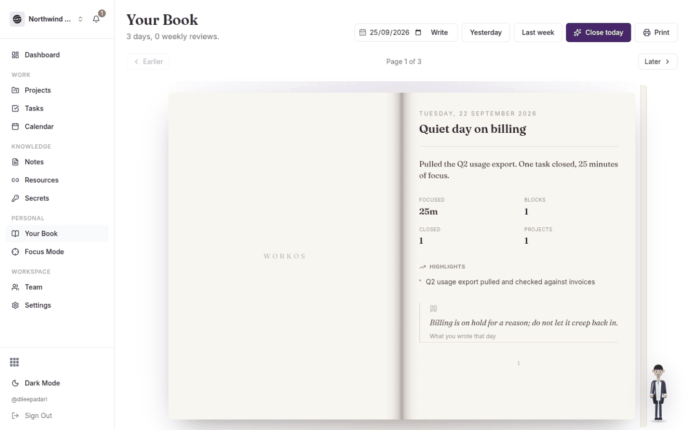
<p align="center"><b>The book</b><br><sub>One page a day, written from what you actually did</sub></p>
</td>
<td width="33%" valign="top">
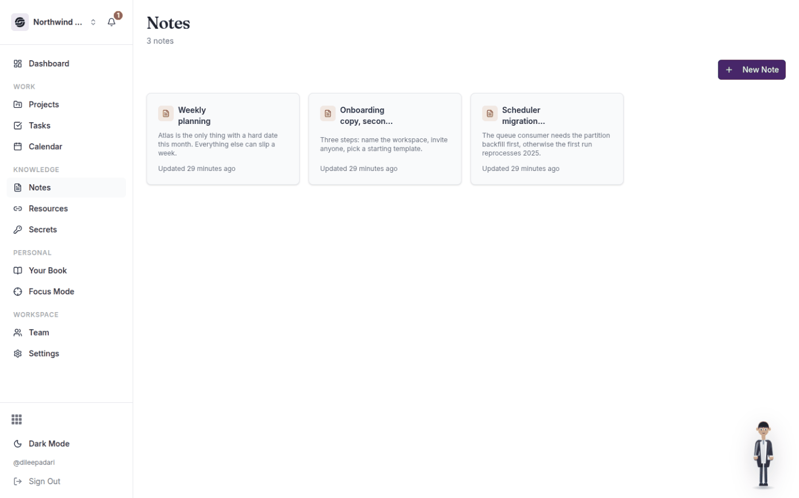
<p align="center"><b>Notes</b><br><sub>Block-editor documents, on their own or on a project</sub></p>
</td>
</tr>
<tr>
<td width="33%" valign="top">
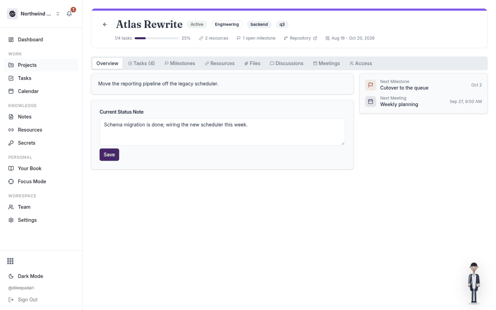
<p align="center"><b>Project detail</b><br><sub>Eight tabs, from milestones to who can see it</sub></p>
</td>
<td width="33%" valign="top">
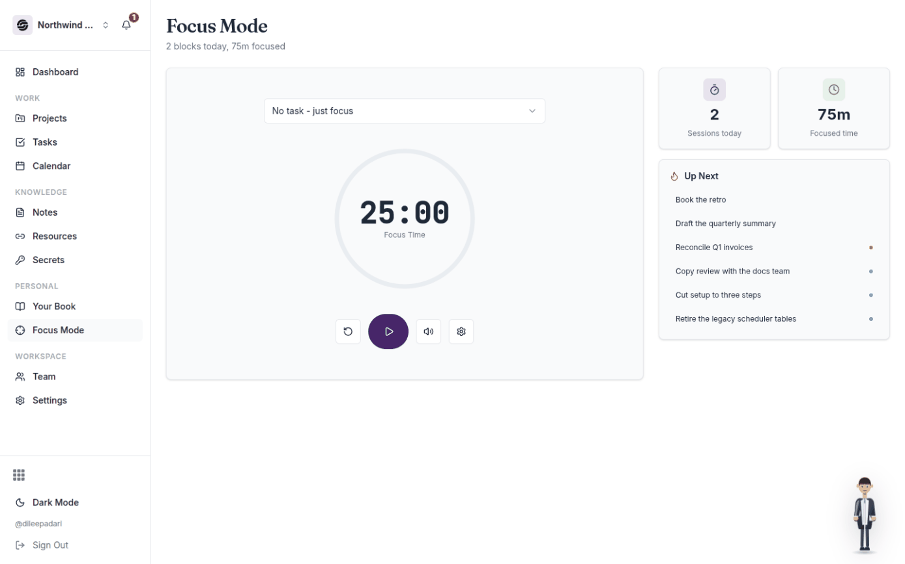
<p align="center"><b>Focus mode</b><br><sub>Timed blocks that become the numbers in the book</sub></p>
</td>
<td width="33%" valign="top">
</td>
</tr>
</table>

<details>
<summary><b>On a phone and a tablet</b></summary>

<table>
<tr>
<td width="25%" valign="top">
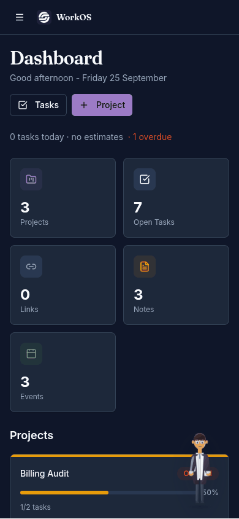
<p align="center"><b>Dashboard</b><br><sub>390px</sub></p>
</td>
<td width="25%" valign="top">
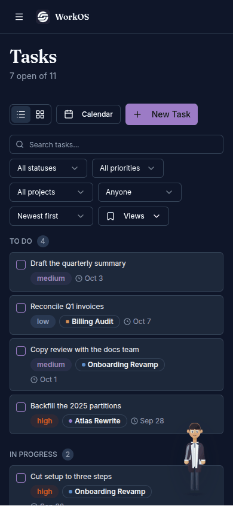
<p align="center"><b>Tasks</b><br><sub>390px</sub></p>
</td>
<td width="50%" valign="top">
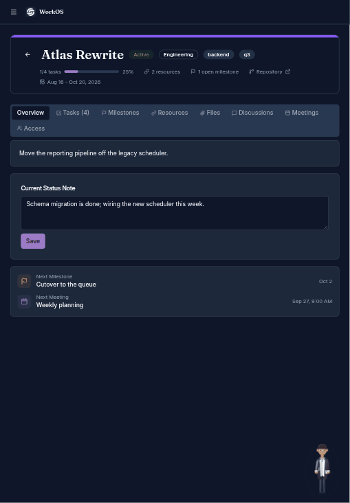
<p align="center"><b>Project</b><br><sub>820px</sub></p>
</td>
</tr>
</table>

The sidebar collapses behind a menu button and the stat grid stacks; there is no horizontal
page scroll at 390px.

</details>

## What you can do

### Dashboard
Your day at a glance: a live clock, a quick-add task bar, and stat tiles for projects, open tasks, links, notes and events. Below that, recent projects with progress bars, a week workload chart, upcoming events, overdue and blocked call-outs, today's agenda, and a next-7-days preview.

### Projects
Create a project with a status (active / on hold / archived), type, tags, colour, repo link and start/target dates. Each project opens into tabs:

- **Overview** - description, an editable "what am I working on right now" status note, live stats and an activity feed
- **Tasks** - grouped by status, with inline status advance, edit and delete
- **Milestones** - dated checkpoints with a "next milestone" call-out
- **Resources** - links and files that belong to the project
- **Files** - documents, specs and designs for the project as a whole; drag and drop to upload
- **Discussions** - threaded comments with @mentions, reactions and file attachments
- **Meetings** - scheduled meetings with a rich agenda and attached files
- **Access** - who can see this project

Browse projects as a grid or list, with search, status/type filters and sorting.

### Tasks
List, board (drag and drop) and calendar views. Every task has a status (To Do / In Progress / Blocked / Done / Dropped), a priority (Low > Urgent), an optional due date and time, a project, an assignee, a rich description and file attachments.

Filter by status, priority, project or assignee; sort by due date, priority, newest or your own manual order; select several at once for bulk changes; and save any filter/sort combination as a named view you can jump back to.

### Notes & Resources
- **Notes** - a searchable card library of rich documents. Click any note to read it in full, with its attachments, without entering edit mode.
- **Resources** - a link vault with categories, tags, short keys (quick-jump codes) and click tracking. Click a card to see the full description, every tag and any attached files. You can paste a URL or upload a file directly, and export the whole vault as CSV.

### Secrets
A workspace vault for API keys, passwords, tokens, SSH keys and database credentials.

Values are **encrypted**, stored masked, and shown only when you click the eye icon - one entry at a time, fetched on demand, and automatically re-hidden after 30 seconds. Copy a value to the clipboard without ever displaying it. Each entry can carry an account name, URL, tags and notes, and everything but the value itself is searchable. Guests never have access.

### Calendar
Month, week and agenda views that pull together tasks, milestones, meetings and manually-added events. Sync from Google Calendar or Outlook via an ICS feed URL, and import/export `.ics` files.

### Your Book
One page per day, written from what you actually did - tasks closed, focus blocks run, meetings attended, notes written, milestones hit. Close the day and the page is generated from real rows; nothing on it is invented, and a day with nothing logged says so rather than padding.

At the end of each week an analysis page is bound in after Sunday: what went well, what to watch, and what is due next. It reads the same numbers, corrected - completions are timestamped properly rather than inferred from when a row was last edited, and weeks start on Monday.

The book opens as a spread and turns like one: the sheet hinges on the spine, carries a page on each face, and loses light as it lifts. Drag a page to turn it, or use the arrow keys. Pages can be **sealed** once you have read them, and a sealed page is not silently rewritten. Print the whole thing to A5, title page included.

### Cherry
An assistant who stands in the corner. Tell her what changed - *"add a task to fix the login redirect for Chubb, high priority, due Friday"* - and she turns it into records.

She never writes anything without showing you first. You get what she understood, then one card per change with every field she extracted, and nothing happens until you tick the ones you want and confirm. If something required is missing she asks for it with the right kind of input and refuses to proceed; if something merely useful is missing she asks but lets you carry on without it.

- **She asks rather than inventing.** A field she cannot quote from your own words is dropped and turned into a question, because a made-up due date looks exactly like one you supplied.
- **She will not guess which row you meant.** Two similar tasks means she asks. A delete she cannot pin down is refused outright rather than attempted.
- **Deleting a project is discouraged** - it takes its milestones, resources and meetings with it, and no undo brings those back, so she offers to archive instead and spells out the loss if you insist.
- **Undo is a real reversal**, driven by what actually got written, including the prior values of anything she changed.
- **Bring your own key** (Anthropic or Gemini), stored encrypted against your account and never sent back to the browser. With no key at all she falls back to a built-in parser that handles direct instructions, so she is never a dead button.

Talk to her by typing or, in browsers that support it, by voice. Pick whether Cherry or Swathi stands in the corner.

### Focus Mode
A Pomodoro timer with configurable focus and break lengths, a chime, browser notifications and an "up next" queue tied to your actual task list. Every completed block is written to the database, so the count survives a refresh and the minutes show up on that day's page.

### Files everywhere
Anywhere you can write, you can attach. Drag and drop or browse to upload documents onto projects, tasks, notes, meetings, resources and individual comments. Files show with a type icon, a size, and one-click download, and images preview inline.

Click any attachment to open it without leaving the app - photos, video, audio, PDFs, and source/text files in a line-numbered code view. Office documents (`.docx`, `.xlsx`) show a download prompt instead: previewing them would mean sending your file to an external viewer, which WorkOS deliberately doesn't do.

Deleting an attachment removes the file from storage for good, so anything embedding it (an image pasted into a note) will break. You'll be warned before it happens.

### Collaboration
Comments on projects, tasks, notes and meetings, written in the same rich editor as everything else, with @mentions, emoji reactions, pinning and attached documents. An activity feed and a notification centre keep you current on mentions and reassignments.

### Team & workspaces
Switch between workspaces, each with its own members, branding and settings. Roles are owner / admin / member / guest at the workspace level, and viewer / commenter / editor per project for guests. Invite teammates by email with expiring links.

### Make it yours
Ten built-in colour palettes (Common/ADK brand, Monokai, GitHub, Material, Original, Dracula, Nord, Solarized, Catppuccin) plus a custom brand-colour picker, shared across the workspace. Light/dark mode, font choice and your assistant are personal to you and stored against your account, so they follow you to another browser rather than living on one machine. A tag manager lets you rename, merge and delete tags across all your content at once.

### Find anything
Press <kbd>⌘K</kbd> / <kbd>Ctrl</kbd>+<kbd>K</kbd> anywhere for a command palette that searches projects, tasks, links, notes and meetings, and <kbd>⌘J</kbd> to open Cherry.

### Your data stays yours
Export your whole workspace as JSON, or just your links as CSV, from Settings.

---

## Getting started

```sh
npm install
cp .env.example .env    # point VITE_SUPABASE_URL at your backend
npm run dev
```

Then open <http://localhost:8080> and sign in.

> **Building or deploying WorkOS?** Architecture, data model, API surface, environment variables and deployment steps are in **[DEVDOC.md](./DEVDOC.md)**.
